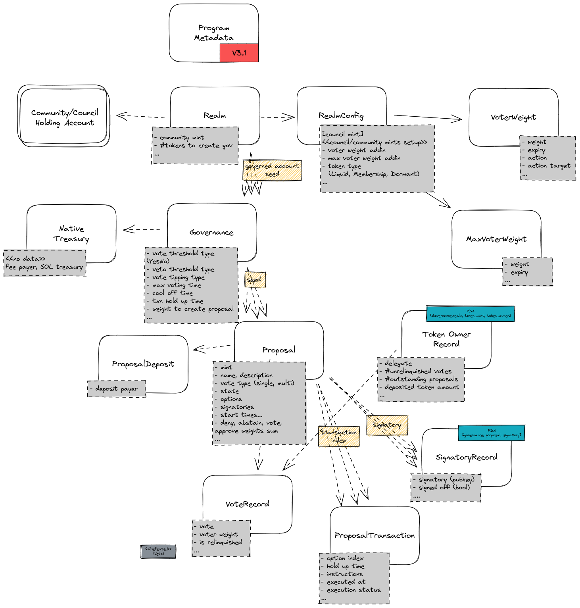
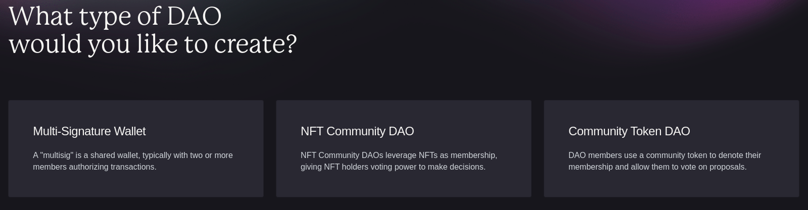
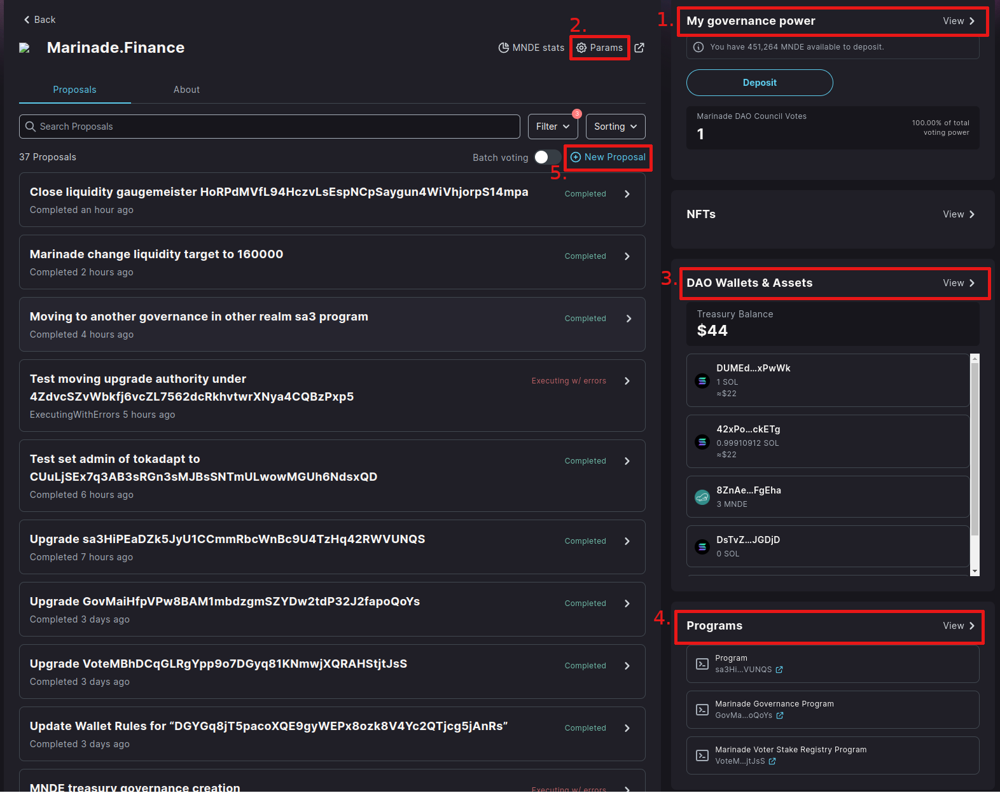
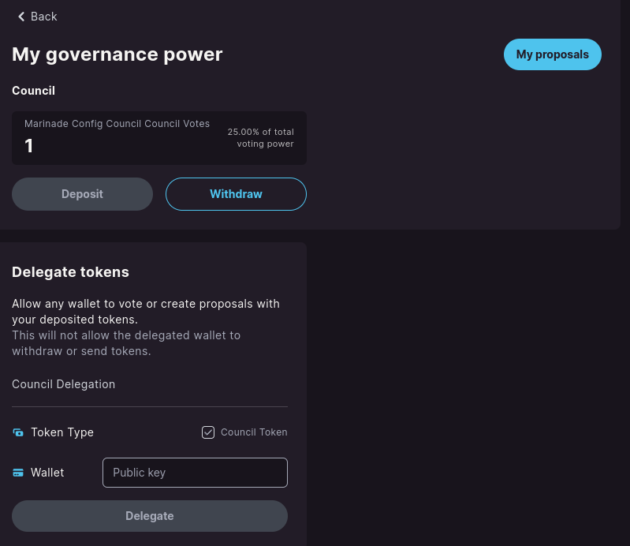
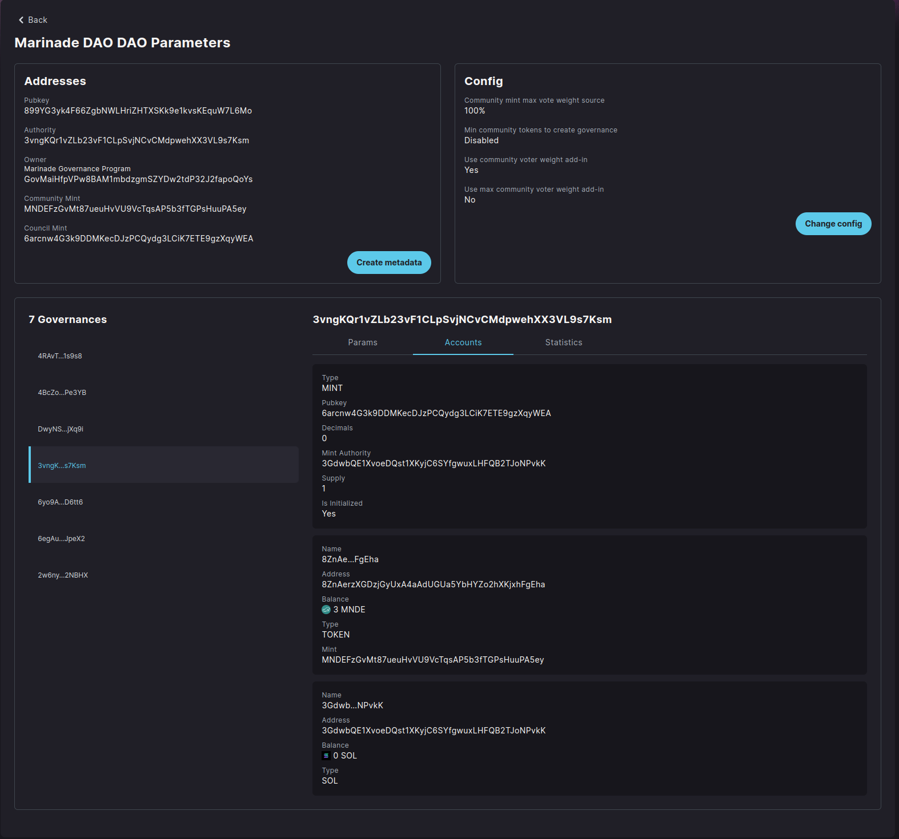
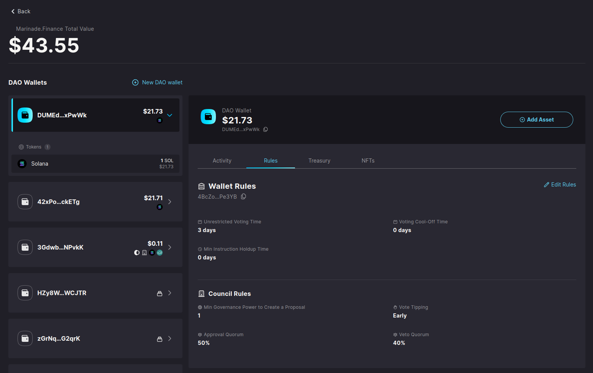
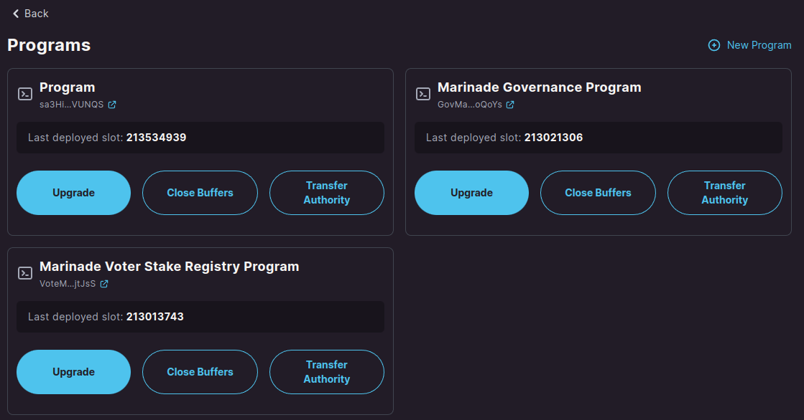
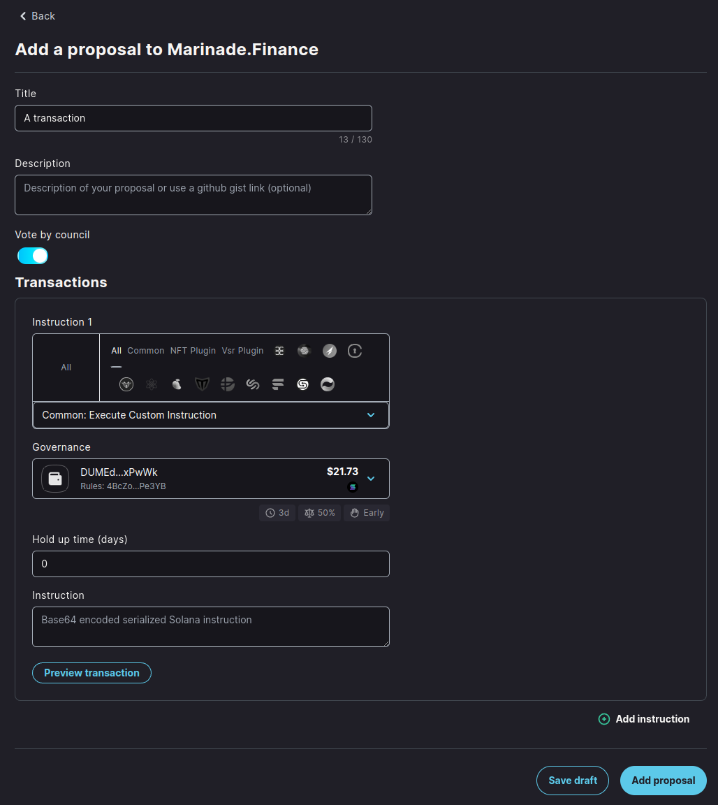

# Solana Program Library Governance

With the Marinade migration from the Tribeca governance system to the Realms of SPL Governance,
we introduce a more technical article on this topic. It's meant for anybody interested in understanding
the Realms system in detail and for anybody planning to integrate with SPL Governance.

## SPL Governance

The SPL Governance is [a Solana blockchain program](https://github.com/solana-labs/solana-program-library/tree/master/governance)
developed as part of the [Solana Program Library](https://spl.solana.com/), meaning the program is developed by guys from Solana Labs.
The program's purpose is to provide a blockchain-based tool to manage [Decentralized Autonomous Organization (DAO)](https://docs.marinade.finance/marinade-dao).

The SPL Governance is designed in a generic manner to cover a good amount of use cases for DAO management.
The cornerstone of functionality covers creating proposals containing blockchain instructions that DAO members may vote upon,
and on successful voting, the instructions may be executed.
A simplistic use case could be to use the system to create a multisig control over distribution of DAO funds.
A heavier use runs smooth DAO management through created instructions that can be voted by the community and/or council,
which consists of minting tokens, transferring funds from the DAO treasury, upgrading the code of programs belonging to the DAO,
and administering the managed programs.

## Where to find, how to get

**IMPORTANT:** This article refers to SPL Governance in version 3.1
[released in December 2022](https://github.com/solana-labs/solana-program-library/releases/tag/governance-v3.1.0).

The program of [SPL Governance](https://github.com/solana-labs/solana-program-library/blob/governance-v3.1.0/governance/README.md)
is part of the Solana Program Library at https://github.com/solana-labs/solana-program-library/tree/governance-v3.1.0/governance.
A shared instance of the program is deployed at `GovER5Lthms3bLBqWub97yVrMmEogzX7xNjdXpPPCVZw`.
While [it's recommended](https://discord.com/channels/910194960941338677/945282322318655528/1079728429697597462)
for DAO in many cases to do [own deployment](https://github.com/solana-labs/solana-program-library/tree/governance-v3.1.0/governance#1-dao-owned-instance)
of the program. That way to take the code from the repository and publish it to the network with a unique address.
An advantage of such approach is that the DAO can manage when the program is upgraded,
a disadvantage could be the DAO has to maintain the program and its upgrades itself.

SPL Governance provides a UI to do DAO management easily. That's available at https://app.realms.today/realms
(to work on devnet, add [`?cluster=devnet`](https://app.realms.today/realms?cluster=devnet) into address bar).
The source code of the UI is available at the repository https://github.com/solana-labs/governance-ui.

**NOTE:** When own deployment of program is done the new address should be configured into UI, into a list of known instances.
 That mostly means [creating a PR](https://github.com/solana-labs/governance-ui/pull/1534) with the configuration.

To integrate the SPL Governance into your own application, you can use the Typescript SDK under the Oyster repository
https://github.com/solana-labs/oyster/tree/main/packages/governance-sdk.

## Other resources

A good complementary resource to this article could be the official 
[README of the governance program](https://github.com/solana-labs/solana-program-library/blob/master/governance/README.md)
at GitHub. A tutorial to UI is available at https://docs.realms.today.

Then a nice technical description of the SPL Governance system can be found at sec3 article
[Solana DAO Governance (Part 1): understanding SPL Governance Workflow](https://medium.com/coinmonks/solana-dao-governance-part-1-understanding-spl-governance-3ccf6d6912bc).
A nice governance UI tutorial is available at [PsyFi documentation page](https://docs.psyoptions.io/psy-token-and-dao/governance-tutorials/governance-overview-and-walkthrough).

## Terms and glossary

The terms used within the SPL Governance system are a bit ambiguous at some places,
so let's pin some of them to clarify their meaning and not missed you in the rest of the text.

### DAO vs. Realm

The term `realm` is used at multiple places within the texts and documentation
of the SPL Gov system. At some perspective it can be considered as equivalent to DAO,
in cases a DAO may consists of several `realms`. Let's elaborate.

From technical perspective the `Realm` is the top level wrapper of configuration setup for DAO.
In this context the [`Realm`](https://github.com/solana-labs/solana-program-library/blob/governance-v3.1.0/governance/program/src/state/realm.rs)
is the top level data structure of the program that all other data structures refers to.

If the DAO, as the organization itself, requires specific configuration for their voting
in such case such decentralized organization could create multiple `Realms`, all belonging under one DAO.
But such configuration is rather exceptional. It's usual that a DAO is managed within one `Realm`.
For that it's usual to consider the terms `dao` and `a realm` equivalent in SPL Governance system.
It's the reason why the `governance-ui` uses both terms interchangeably.

### Governance vs. DAO Wallet

The term governance is ubiquitous. You can find it in the name of library, the purpose of the program is to
__govern__ the DAO. Thus eyes looking into repository will reach the
[governance](https://github.com/solana-labs/solana-program-library/blob/governance-v3.1.0/governance/program/src/state/governance.rs)
term naturally quite promptly. From code perspective it's a data structure that defines a content of Solana account.
It's strictly bound to one realm (see above). The governance consists of set of configuration parameters
for voting over proposals. On top, the governance determines strictly unique
[DAO wallet containing native SOL](https://github.com/solana-labs/solana-program-library/blob/governance-v3.1.0/governance/program/src/state/native_treasury.rs).
It's a Solana account that holds native SOL tokens owned by `System program`, created as PDA seeded by governance account address.
The SPL Governance program names the DAO Wallet with term `native treasury`.
Any transaction executed on behalf of particular realm belongs under a governance
which may use the DAO wallet as fee payer.

The UI differentiates between the governance and DAO wallet but it's needed to know that these terms are coupled.

**NOTE:** It is highly recommended to utilize the address of
[the DAO wallet](https://github.com/solana-labs/solana-program-library/blob/governance-v3.1.0/governance/NOTES.md#dao-wallet)
(i.e., `governance native treasury address`) as the authority for managing any assets under the `Realm`. 
This includes matters such as a mint authority, a token owner authority, or a contract custom admin authority with permission to make configuration changes.
While using the governance address for these purposes is possible, it is not considered a best practice.

### Proposal

It's a submission represented by a poll where voters place their pro or con attitudes. When the poll successfully passes,
the proposal is considered successful and if the submission contains a transaction, it can be executed to seal the resolution of the voting.

The resolution of voting depends on number of votes gained while threshold of success are defined in configuration
by  the creator of the voting. These are parameters placed within the governance
as every proposal belongs under one governance.

A voter is represented by a wallet containing tokens that identify the voting power of the voter.

## SPL Governance account structure

The Governance account structure is documented
[in the repository](https://github.com/solana-labs/solana-program-library/blob/governance-v3.1.0/governance#program-accounts).
But let's have a look at the account hierarchy in more detail. We will start with the picture of all available accounts and then
have a description of them. 

The top-level account (representing a DAO as explained above) is
[the `Realm` account](https://github.com/solana-labs/solana-program-library/blob/governance-v3.1.0/governance/program/src/state/realm.rs#L124).
The address of the realm account is
[calculated as PDA address](https://github.com/solana-labs/solana-program-library/blob/governance-v3.1.0/governance/program/src/state/realm.rs#L125)
identified by its name. There cannot be created two realms with the same name, the name cannot be changed while a display name used
for example in Governance UI
[can be modified](https://discord.com/channels/910194960941338677/964818745786789898/1093478043382722580).

The realm is defined by two groups of voting population - `council` and `community`.
Each voting population configure its `mint` while the field of `community_mint` can be defined only at the time of creation and cannot be changed later
(different community mints are available with creating a new realm or with applying plugin functionality like
[Voter Stake Registry (VSR)](https://github.com/blockworks-foundation/voter-stake-registry).
Members of the population have the ability to create a proposal with or without instructions for execution upon successful voting.
The creator of the proposal establishes the voting population.
For example, when a proposal is created for the council to vote on, only council members are eligible to vote.
However, members of the other population, in this case, the community, may veto the proposal.

In addition, the realm encompasses other configuration parameters, including the rule for when a new governance instance can be created.
A new governance instance can be created when the instruction is signed by the Realm `authority` address,
by a council member who owns at least one token, or by a community member who possesses enough voting power
as specified in the Realm account.

The configuration of the realm is held in separate Solana account which is the
[`RealmConfigAccount`](https://github.com/solana-labs/solana-program-library/blob/governance-v3.1.0/governance/program/src/state/realm_config.rs#L80).
The Realm structure contains a field `realm_config` which stores a public key that refers to a separate account of `RealmConfigAccount`.
The realm config defines what type of token (liquid, membership, dormant/disabled) is used for a particular group of voters
or usage of a plugin for voter weight calculation (e.g., VSR plugin).

The realm groups a few or multiple [`Governance`](https://github.com/solana-labs/solana-program-library/blob/governance-v3.1.0/governance/program/src/state/governance.rs#L80) accounts.
Governance is a basic configuration unit that defines limits for creating proposals, voting time, thresholds, if voting may be finished before
voting time elapses (`vote tipping`), if vetoing proposals is permitted, and as last but not least,
it signs the transactions to be executed (with governance and native treasury (DAO Wallet) keys).

**NOTE:** As any other account mentioned in this listing the governance account is a PDA account that's seeded with the realm account address
and a `governance_seed`. Previously it the `governance_seed` was an pubkey of governed program but this concept is obsolete now.
The the `governance seed` should be considered as an arbitrary public key that's used only to seed the governance account address.
The `Governance` may manage whatever asset (token, program, ...) and it's not limited to a single governed program address.

**NOTE:** Similar to all other accounts listed here, the governance account is a PDA account.
It is seeded with the realm address and a `governance_seed`. Previously, the `governance_seed` was a public key of the governed program,
but this concept is now considered obsolete. The `governance_seed` should be treated as an arbitrary public key
used solely to seed the governance account address. The `Governance` has the ability to manage any asset,
whether it be a token, program, or other, and is not limited to a single governed program address.

The last part of the account structure hierarchy is the
[`Proposal`](https://github.com/solana-labs/solana-program-library/blob/governance-v3.1.0/governance/program/src/state/proposal.rs#L105)
The proposal is created within one particular governance.
Proposal is bounded to a single mint (`governing_token_mint`) that defines the population (council or community) that may vote for it.
The proposal consists of several options (determined by a string label) that the voting population chooses from. There is optionally defined
instructions for particular options that are executed on when the option successful passed.
After creation, the proposal goes through lifecycle defined by [several states](https://github.com/solana-labs/solana-program-library/blob/governance-v3.1.0/governance/program/src/state/enums.rs#L101). The lifecycle state designates permitted operations
over the proposal - only at certain state the proposal can be cancelled, voted for, transaction execution can be run etc.

### Different types of governances

When one checks the SPL Governance program in version 3.1 one may notice that different types of governances can be created.
Those are the
[mint, program and token](https://github.com/solana-labs/solana-program-library/blob/governance-v3.1.0/governance/program/src/state/governance.rs#L126)
governance account types.
All of those are
[considered deprecated](https://github.com/solana-labs/solana-program-library/blob/governance-v3.1.0/governance/NOTES.md#asset-specific-governances-are-deprecated)
but as of now heavily used within Governance UI (because of some
[technical limitations](https://discord.com/channels/910194960941338677/910566058740568094/1098293000028831824)).

## Lifecycle of a proposal

As said before the proposal goes through lifecycle defined by several states. Let's have a look at them in more details.

### Draft

A new proposal is created in `Draft` state. The proposal consists of set of options (each of them is determined by a string label
and an index in the array where it's stored).
When in `Draft` state the creator of the proposal may add multiple signatories to the proposal with
[`AddSignatory` instruction](https://github.com/solana-labs/solana-program-library/blob/governance-v3.1.0/governance/program/src/processor/mod.rs#L162).
The proposal moves to `Voting` state only when all signatories sign the "drafted" proposal (we consider "drafted" proposal one in `Draft` or `SigningOff` state).
That way one may ensure that the proposal won't leave the "drafted" state until all defined signatories confirms the proposal is prepared
to be voted on (i.e., until not ready to take votes).

Calling the `AddSignatory` instruction is not required as for moving the proposal to `Voting` state at least the signatory of the creator is required.
When a signatory has been appointed by calling the `AddSignatory` instruction then signature of the creator is not demanded
for the proposal to move to `Voting` state.
When a first signatory signs the proposal by call of the `SignOffProposal` instruction the proposal moves to `SigningOff` state
and no other signature can be added.
When all signatories (or the creator herself) sign the proposal the proposal moves to `Voting` state
immediately at the call of `SignOffProposal` instruction.

Until the proposal is in `Voting` state one can call `InsertTransaction` instruction to bound instructions to an option of the proposal.
The option is defined by an index within the array structure and that index is passed to `InsertTransaction` instruction.
The call may be repeated for the same option to place in multiple instructions.
As well, the insructions can be grouped into array of instructions that are executed atomically.
The inserted [list of instructions](https://github.com/solana-labs/oyster/blob/040b7c89f757846f64c2436dbb58ecc4db8c5837/packages/governance-sdk/src/governance/withInsertTransaction.ts#L14)
is stored in
(a transaction account)[https://github.com/solana-labs/solana-program-library/blob/governance-v3.1.0/governance/program/src/state/proposal_transaction.rs#L102] and at the time of execution the
(`ProcessExecuteTransaction`)[https://github.com/solana-labs/solana-program-library/blob/governance-v3.1.0/governance/program/src/processor/process_execute_transaction.rs]
takes the transaction account and executes the instructions stored in it.
The address of the transaction account is calculated from
(the proposal publickey, index of the option and index of the instruction)[https://github.com/solana-labs/oyster/blob/040b7c89f757846f64c2436dbb58ecc4db8c5837/packages/governance-sdk/src/governance/accounts.ts#L1241].

**NOTE:** On creating a proposal, there is deposited
[a certain amount of SOLs](https://github.com/solana-labs/solana-program-library/blob/governance-v3.1.0/governance/program/src/processor/process_create_proposal.rs#L188)
to custody of the Governance system. The amount increases based on the currently active proposals.
The deposited amount
[can be refunded](https://github.com/solana-labs/solana-program-library/blob/governance-v3.1.0/governance/program/src/processor/process_refund_proposal_deposit.rs)
when the voting on proposal is finished.
The reason for that is to prevent spamming the system with proposals that are not going to be voted on.
It's the benefit of UI that such maintenance operations are handled automatically.

### Voting

When all signatories considers proposal is ready to be signed When all transactions are in place and every signatory was acknowledged by call of
[`SignOffProposal`](https://github.com/solana-labs/solana-program-library/blob/governance-v3.1.0/governance/program/src/processor/mod.rs#L168)
instruction then with the last signature the proposal is moved to `Voting` state.
In this state the proposal is ready to take votes.
Voting population of `council` or `community` may vote on the proposal. They can vote for the proposal or cast `deny` votes against the proposal.
The voting is done by calling
[`CastVote` instruction](https://github.com/solana-labs/solana-program-library/blob/governance-v3.1.0/governance/program/src/processor/mod.rs#L171).
Voting time is defined by
[`voting_base_time`](https://github.com/solana-labs/solana-program-library/blob/governance-v3.1.0/governance/program/src/state/governance.rs#L43)
governance attribute and can be prolonged by setting-up
[`voting_cool_off_time`](https://github.com/solana-labs/solana-program-library/blob/governance-v3.1.0/governance/program/src/state/governance.rs#L65)
when only negative votes (`deny` and `vetoes`) are accepted.
The voting may be finished before the voting time elapses when
[`vote tipping`](https://github.com/solana-labs/solana-program-library/blob/governance-v3.1.0/governance/program/src/state/governance.rs#L45) is enabled.

The voter may change his mind and cast another vote. That has to be done by first calling the
[`RelinquishVote`](https://github.com/solana-labs/solana-program-library/blob/governance-v3.1.0/governance/program/src/processor/mod.rs#L175)
that removes the voting power from the option and then new vote can be casted.

When the voting time elapses and the proposal was not tipped, to be finished sooner, one needs to call 
[`FinalizeVote`](https://github.com/solana-labs/solana-program-library/blob/governance-v3.1.0/governance/program/src/processor/mod.rs#L173)
instruction for the proposal being moved to `Succeeded` (a non final) or `Defeated` (a final) state.
The `FinalizeVote` instruction checks the number of `yes` votes and number of `deny` votes at all options of the proposal, considers the
[type of the proposal](https://github.com/solana-labs/solana-program-library/blob/governance-v3.1.0/governance/program/src/state/enums.rs#L144)  and then decides.

The workflow for `Veto` votes is a bit different. The proposal is moved to final `Vetoed` state when veto threshold is met.
This is checked at every `CastVote` call regardless the `vote tipping` is enabled or not.

During the time the proposal is in the `Draft` state or under `Voting` the proposal may be cancelled.
When it happens the proposal is moved to a final `Cancelled` state.
Only the owner of the proposal is permitted to call the instruction [`CancelProposal`](https://github.com/solana-labs/solana-program-library/blob/governance-v3.1.0/governance/program/src/processor/mod.rs#L177).
The term owner means a token owner record account (see below) that was inserted into the proposal account on its creation.

### Finalization

When the proposal ends in the `Succeeded` state, the instructions bound to the proposal's option may be executed.
Besides the proposal final state, each option marks its final state separately.
Only those options that were marked as [`Succeeded`](https://github.com/solana-labs/solana-program-library/blob/governance-v3.1.0/governance/program/src/state/proposal.rs#L41) may execute attached instructions with the call of [`ExecuteTransaction`](https://github.com/solana-labs/solana-program-library/blob/governance-v3.1.0/governance/program/src/processor/mod.rs#L196).

The governance may configure [`min_transaction_hold_up_time`](https://github.com/solana-labs/solana-program-library/blob/governance-v3.1.0/governance/program/src/state/governance.rs#L37), which adds the time when the instruction can be started to be executed. Only after that number of seconds elapsed after proposal finalization the instruction may be executed.

When all instructions are executed the proposal is moved to final [`Completed`](https://github.com/solana-labs/solana-program-library/blob/governance-v3.1.0/governance/program/src/state/enums.rs#L121) state.

There is one more eventuality where the instructions from the proposal fail to be executed. That could be caused by wrongly composed instructions
(e.g., wrong accounts passed to the instruction) or the state of the blockchain changed since the proposal was created and the constraints
for the instruction executions cannot be met anymore.
In that case the proposal may be marked as
[`ExecutingWithErrors`](https://github.com/solana-labs/solana-program-library/blob/governance-v3.1.0/governance/program/src/state/enums.rs#L121)
by calling appropriate instruction (called by the proposal creator).

## Survey type proposals

There is one special "type" of proposal that goes through the lifecycle slightly differently than usual proposals.

There is one special "type" of proposal that goes through the lifecycle slightly differently then usual proposals.
I used the word "type" in quotes because it is not a real type of proposal but just a proposal with a specific attributes.
When you create a proposal without any instructions attached to it and deny vote type
[is not permitted](https://github.com/solana-labs/solana-program-library/blob/governance-v3.1.0/governance/program/src/processor/process_create_proposal.rs#L40), it is considered a survey-type proposal.

The survey-type proposal has no effect on the state of the blockchain and is used to collect the opinion of the community.

The survey-type proposal does not progress to the `Succeeded` state and immediately moves to the `Completed` state when the voting ends.

## Voting and Locking Tokens

We have discussed the data structures and workflow of the SPL Governance but have not yet touched on the topic of voting. Who can vote on proposals
and how is the voting power calculated?

The voter must be an owner of the tokens. A `realm` is created with the definition of the `community` and `council` mints. Ownership of the token
gives the right to vote on proposals. Voting power is calculated as the ratio of the locked number of tokens owned by the voter
and the maximum voter weight of tokens for the mint.
The maximum voter weight could be considered as the total supply of tokens for the mint.
That's strictly true for `council` token. For community tokens one can configure `realm` attribute
[community_mint_max_voter_weight_source](https://github.com/solana-labs/solana-program-library/blob/governance-v3.1.0/governance/program/src/state/realm.rs#L43)
where beside the total supply of tokens
[the max voter weight](https://github.com/solana-labs/solana-program-library/blob/governance-v3.1.0/governance/program/src/state/proposal.rs#L519)
 could be defined as an absolute number or for taking only a fraction of the total supply.
 The other option to configure this is to use the plugin system (see below).

Beside that the `realm` configures
[how the token is considered](https://github.com/solana-labs/solana-program-library/blob/governance-v3.1.0/governance/program/src/state/realm_config.rs#L21).
If the token type is `membership` then the token is controlled by the `realm`. The token cannot be transferred to another wallet.
When the token type is `liquid` then the token can be freely transferred and traded, the mint authority is controlled either by `realm` or
by any other entity. The `dormant` token type says that part of voting population is disabled in the `realm`.

For the voter to employ their voting power, they must lock the tokens to the `realm`. This is done by
a [deposit call](https://github.com/solana-labs/solana-program-library/blob/governance-v3.1.0/governance/program/src/processor/process_deposit_governing_tokens.rs). The tokens are locked until any active proposal where the voter voted exists.
For the owner to withdraw the funds he has to wait until voting period ends or when he relinquishes his votes.

The SPL Governance creates an account [`token owner record`](https://github.com/solana-labs/solana-program-library/blob/governance-v3.1.0/governance/program/src/state/token_owner_record.rs#L33) for each voter (more precisely, for every wallet). 
This record keeps track of how many tokens were locked, as well as the number of active proposals
that the voter has voted for and number of un-relinquished proposals to determine whether a withdrawal is possible.

The number of locked tokens under the `token owner record` determines the voting power of the owner of the record.
The owner may delegate this voting power to another wallet by setting up
[the delegate field](https://github.com/solana-labs/solana-program-library/blob/governance-v3.1.0/governance/program/src/state/token_owner_record.rs#L80)
in the `token owner record`.
Only one delegate can be defined per token owner record.

### Vote record

[Casting a vote](https://github.com/solana-labs/solana-program-library/blob/governance-v3.1.0/governance/program/src/processor/process_cast_vote.rs#L31)
means to add the voting weight to the proposal option.
The voter can choose to vote for or against the proposal or to abstain from voting.
The type of vote is defined by the
[`Vote` enum](https://github.com/solana-labs/solana-program-library/blob/governance-v3.1.0/governance/program/src/state/vote_record.rs#L48)
and passed as an argument in the
[cast vote instruction](https://github.com/solana-labs/solana-program-library/blob/governance-v3.1.0/governance/program/src/processor/process_cast_vote.rs#LL34C14-L34C14).

When a voter casts their vote, information about this action is written to two places in the Solana blockchain.
First, the proposal account is updated with the summary of the
[weight of votes](https://github.com/solana-labs/solana-program-library/blob/governance-v3.1.0/governance/program/src/state/proposal.rs#L60) for each option, which is used during proposal finalization (`vote records` are not used for this purpose).

Second, a [`vote record`](https://github.com/solana-labs/solana-program-library/blob/governance-v3.1.0/governance/program/src/state/vote_record.rs)
account is created. This record gathers information such as the casted voting weight, type of vote, etc. The existence of the record attests that a vote has been cast from a particular `token owner record` for a particular proposal. The vote record is used to prevent double voting and for historical purposes.

## Plugin System

The SPL Governance program is designed to be extensible. In version 3.1, there are two available extension points:
[`voter weight` and `max voter weight`](https://github.com/solana-labs/solana-program-library/blob/governance-v3.1.0/governance/addin-api/README.md)
addins.

The configuration of the realm defines that there is an addin to be used for any calculation of
[the voting power (voter weight) and max voter weight](https://github.com/solana-labs/solana-program-library/blob/governance-v3.1.0/governance/program/src/state/realm_config.rs#L64).
This way, the voting power cannot depend solely on the number of locked tokens of the mint
but mostly anything can be used for the calculation.

## Governance UI

You most likely use the web-based UI as the primary point of interaction with the SPL Governance program.
Therefore, we will conclude this article with a brief overview of the discussed concepts in the context of the UI.

### Creating a Realm

When you navigate to [the Realms page](https://app.realms.today/) , you can see the list of existing realms.
Clicking on the `Create DAO` button presents you with three options to choose from:

All three options present a walkthrough wizard where different default parameters are predefined,
and a different set of parameters has to be provided. The `Multi-Signature` wallet option creates
a `Realm` where only the council is expected to vote, and community is not enabled. The `NFT Community DAO` option creates 
a `Realm` where voting power comes from ownership of NFTs. It is a voter weight plugin that provides functionality
for voting power calculation. The `Community Token DAO` is meant for community-driven DAOs
where both the `council` and `community` are enabled.

When a `Realm` is created, the main Realm configuration page is presented. When you change some config,
it is usually done via a configuration page that ends up creating a `proposal`.
The proposal is a usual way to change the configuration of the `Realm` and `Governance`.

Let's discuss the most important parts of the UI:

- **1.) My governance power** - After connecting the wallet, the user can deposit tokens to the `Realm`
  and manage their delegation of voting power, withdraw tokens, and check on their created proposals.
  The `My Proposals` button shows proposals that the token owner has voted for, including active and unrelinquished ones.
  The menu names the _unrelinquished proposals_ as `Unreleased Proposals`. To withdraw tokens, the user has
  to relinquish all proposals (i.e., `Release All` button).
  Even for finished proposals, the user has to do the unrelinquish action to withdraw tokens.

  

- **2.) Params** - This section shows the parameters of the `Realm` and allows for changes. The user can change
  the configuration of the `Realm` (`RealmConfig`) in the top right corner by clicking on `Config -> Change Config`.
  All `Governance` instances are listed below, and the voting settings can be changed by clicking
  on the `Change Config` button. There are other tabs on the right side of the list of `Governance` instances,
  including `Accounts`, where the user can list all related accounts to the Governance.
  The `Accounts` tab lists the `native treasury` wallet, ATA token wallets managed by the governance, program accounts
  or a mint if available

  

- **3.) DAO Wallets** - This section provides a different perspective on the `Governance` accounts.
  Importantly, the user can create a new Governance instance by clicking on the `New DAO wallet` button.
  The list below the button represents the addresses of the `native treasury` wallets (every `Governance` has one).
  To add an asset to a wallet, the user can click on the `Add Asset` button at the to right side.
  A new token account can be crated so. The tabs on the right side of the list of `native treasury` addresses
  show a list of processed transactions. The `Rules` tab provides a way to change `Governance` parameters
  (similar to `Params` subpage), and the `Treasury` and `NFTs` tabs provide information about the assets.

  

  - **4.) Programs** - This section allows the user to manage the `upgrade authority` of programs and do code upgrades.
    The `New program` button creates a new program type `Governance` (see _Different types of governances_)
    and takes management power for the program.

  

- **5.) New proposal** - The last section we will touch on is the `New proposal` screen. Here, the user can create
  a new proposal that can be chosen from a list of common proposals (such as mint token, transfer, etc.) or pass a base64-encoded transaction as a proposal. The switch `Vote by council` defines if the proposal will be created
  as a council or community proposal (a council proposal is voted only by the council and vice versa).
  At `Preview transaction` button, the user can check the instruction by simulating it.
  The `Add proposal` button then creates a new proposal that is eventually listed on the main configuration page.

  

## Conclusion

In this article, we have discussed the SPL Governance program and its main concepts. We have also touched on the
UI and its main features. We hope that this article will help you understand the SPL Governance program better.