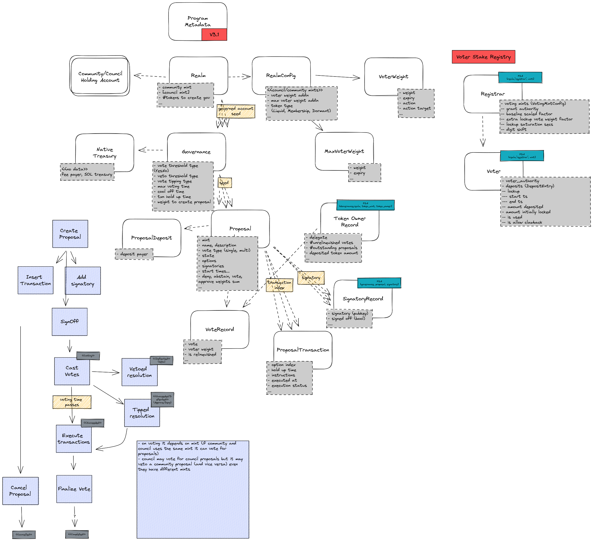

# Solana Program Library Governance

With Marinade migration from Tribeca governance system to Realms of SPL Govevernance
we introduce a bit more technical article on this topic.
It's meant for anybody interested to understand the Realms system in details
and for anybody planning to integrate with SPL Gov.

## SPL Goveranance

Let's talk from technical perspective here.
The SPL Governance is [a Solana blockchain program](https://github.com/solana-labs/solana-program-library/tree/master/governance)
developed as part of the [Solana Program Library](https://spl.solana.com/), meaning the program is developed by guys from Solana Labs.
The program purpose is to provide a blockchain based tool to manage [Decentralized Autonomous Organization (DAO)](https://docs.marinade.finance/marinade-dao).

The SPL Governance is designed in generic manner to cover good amount of use cases for DAO management.
The corner stone of functionality covers creating a proposals containing blockchain instructions
that DAO members may vote upon and on succesful voting the instructions may be executed.
A simplistic use case could be to use the SPL Gov system to create a multisig control
over distribution of DAO funds.
A heavier use runs smooth DAO management through created instructions that can be voted by community and/or council
which consist minting tokens, transfering funds from DAO treasury, upgrading code of programs belonging to DAO
and being an admin authority of the managed programs.

## Where to find, how to get

**IMPORTANT:** whole this article refers to SPL Governance in version 3.1
[released in December 2022](https://github.com/solana-labs/solana-program-library/releases/tag/governance-v3.1.0). 

The [SPL Governance](https://github.com/solana-labs/solana-program-library/blob/governance-v3.1.0/governance/README.md)
program an be found as part of the Solana Program Library at https://github.com/solana-labs/solana-program-library/tree/governance-v3.1.0/governance
It's deployed at `GovER5Lthms3bLBqWub97yVrMmEogzX7xNjdXpPPCVZw` while
[it's recommended](https://discord.com/channels/910194960941338677/945282322318655528/1079728429697597462) for DAO to do
[own deployment](https://github.com/solana-labs/solana-program-library/tree/governance-v3.1.0/governance#1-dao-owned-instance)
of the SPL Gov program.

SPL Governance provides an UI that is used for DAO management, it's available at https://app.realms.today/realms
(to work on devnet add [`?cluster=devnet`](https://app.realms.today/realms?cluster=devnet)).
The source code is at respository https://github.com/solana-labs/governance-ui

**NOTE:** for a self deployed program to work properly in UI it's good to add it to the list of known SPL Gov instances
which means adding the address to UI configuration file with [creating a PR](https://github.com/solana-labs/governance-ui/pull/1534).

To integrate the SPL Governance to your own application you can use the Typescript SDK under Oyster
repository https://github.com/solana-labs/oyster/tree/main/packages/governance-sdk

## Terms and glossary

The terms used within the SPL Governance system are a bit ambiguous at some places,
so let's pin some of them to clarify their meaning and not missed you in the rest of the text.

### DAO vs. Realm

The term `realm` is used at multiple places within the texts and documentation
of the SPL Gov system. At some perspective it can be considered as equivalent to DAO,
in cases a DAO may consists of several relms. Let's elaborate.

From technical perspective the `Realm` is the top level wrapper of configuration setup for voting over proposals.
The [`Realm`](https://github.com/solana-labs/solana-program-library/blob/governance-v3.1.0/governance/program/src/state/realm.rs)
is as well the top level data structure within the SPL Gov program library that all other data structures points to.

If the DAO, as the organization itself, requires some really specific configuration for their voting
it can happen that in such case multiple `Realms` are created belonging under such decentralized organization.
Such configuration is exceptional and it is usual that DAO is managed within one `Realm`.
For that it's usual to consider the terms `dao` and `a realm` equivalent in SPL Gov system.
It's the reason why the `governance-ui` uses both terms interchangeably.

### Governance vs. DAO Wallet

The term governance is pretty ubiquituous here. You can find it in the name of library, the purpose of the program is to
govern the DAO and thus eyes looking into repository will reach the
[governance](https://github.com/solana-labs/solana-program-library/blob/governance-v3.1.0/governance/program/src/state/governance.rs)
term naturarly quite promply. From code perspective the governance consists of set of configuration parameters
with definitions for voting. On top of it the governance defines
[a DAO wallet containing native SOL](https://github.com/solana-labs/solana-program-library/blob/governance-v3.1.0/governance/program/src/state/native_treasury.rs)
(as any other walled account owned by System program, as PDA seeded by governance account addres).
The program names the DAO Wallet with term `native treasury`.
Any transaction executed on behalf of particular realm belongs under a governance which may use the DAO wallet
as fee payer.

**NOTE:** it's recommended to use the DAO wallet address as authority, instead of governance address,
for any program that will be managed by the realm
(i.e., program defines an authority or admin field in its account that has got permission to do configuration changes)

### Proposal

It's a submision of a proposition representied a poll where voters places their pro or cons attitudes. When the poll sucessfuly passes
the proposal is considered sucesful and if the submission contains a transaction it can be executed to seal
the resolution of the voting.

The voting parameters could be configured on when the proposal is considred succesful (e.g., what percentage of pro votes must be aquired),
what is voting power of a particular voter (normally relates to number of tokens the voter holds) etc.

## SPL Governance account structure

The Governance account structure is documented
[in the respository](https://github.com/solana-labs/solana-program-library/blob/governance-v3.1.0/governance#program-accounts).
But let's have a look at the account hierarchy in more details. We will start with the picture all available accounts and then
having a description of them. 

The top level account (representing a DAO as explained above) is
[the `Realm` account](https://github.com/solana-labs/solana-program-library/blob/governance-v3.1.0/governance/program/src/state/realm.rs#L124).
The realm is defided by its name (there cannot be two realms with the same name for deployment of one governance program).
The realm defines two groups of voting population - `council` and `community`.
Each voting population is defined by its `mint` while the field of `community_mint` can be defined only at time of creation and cannot be changed
(adding different mints to the community is possible either by creating a new realm or with applying a `voter weight plugin` like
[Voter Stake Registry (VSR)](https://github.com/blockworks-foundation/voter-stake-registry) one).
Members of the group may create a proposal (with or withouth instructions to be executed on sucesfful voting). Only members of the group
that created the proposal may vote for it (i.e., the proposal is created by the council and only council members may vote for it), while the
other group (members of the community) may veto the proposal.
In addition, the realm configuration defines rules when a new governance can be created.

The configuration of realm is held in the
[`RealmConfig`](https://github.com/solana-labs/solana-program-library/blob/governance-v3.1.0/governance/program/src/state/realm_config.rs#L80) account.
The realm config defines what type of token (liquid, membership, dormant/disabled) is used for particular group of voters.
And here is where it's possible to define a custom plugin for voter weight calculation (e.g., VSR plugin).

The realm groups few or multiple [`Governance`](https://github.com/solana-labs/solana-program-library/blob/governance-v3.1.0/governance/program/src/state/governance.rs#L80).
Governance is the basic configuration unit that defines limits for creating proposals, voting time, thresholds, if voting may be finished before
voting time elapses (`vote tipping`), if vetoing proposals is permitted and as last but not least
it signs the transactions to be executed (with governance and native treasury (DAO Wallet) keys).

The last part of the account structure hiearchy is the
[`Proposal`](https://github.com/solana-labs/solana-program-library/blob/governance-v3.1.0/governance/program/src/state/proposal.rs#L105) itself.
The proposal is created within one particular the governance.
Proposal is created with a single mint (`governing_token_mint`) that defines the population (council or community) that may vote for it.
The proposal consists of several options (determined by a string label) to vote for and optionally transactions that are executed.
The proposal can be in [several states](https://github.com/solana-labs/solana-program-library/blob/governance-v3.1.0/governance/program/src/state/enums.rs#L101)
that define operations that are permitted on the proposal (cancelling, voting, executing transactions, etc.).
When voting on a proposal finishes it has got a vote result state and considers transactions to be executed on its behalf.

## How the voting works

- token owner record